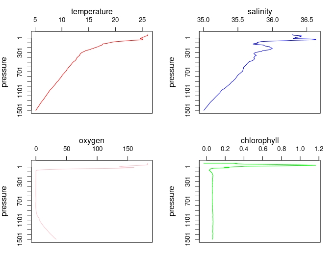
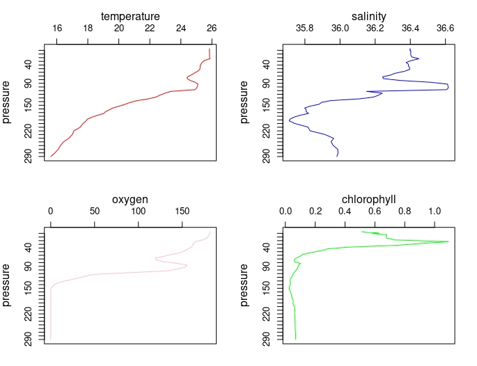
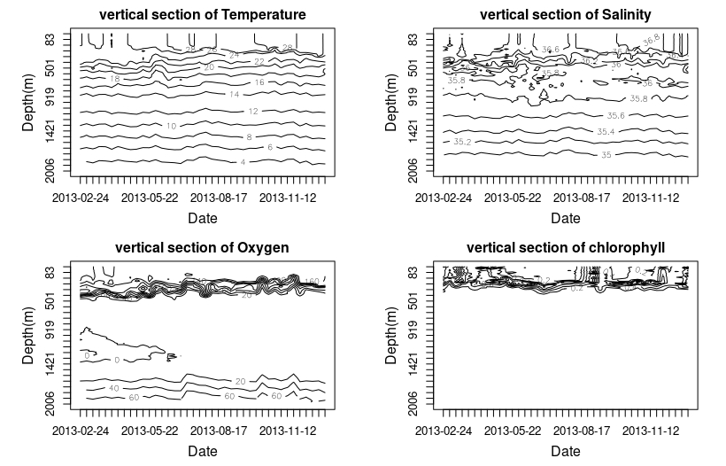
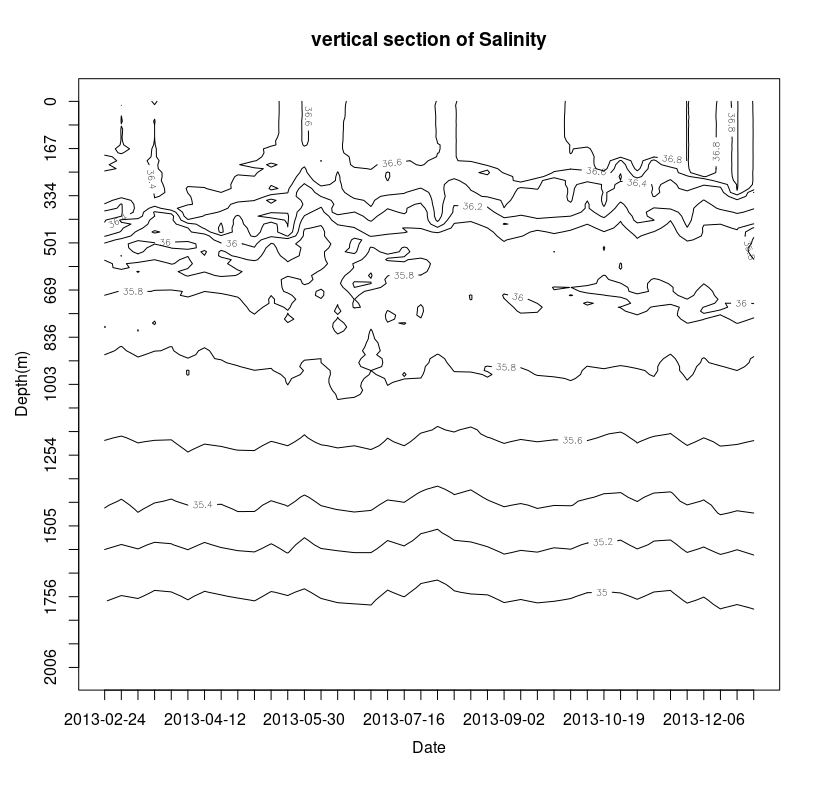
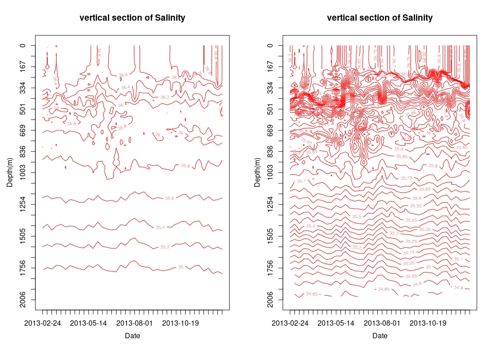
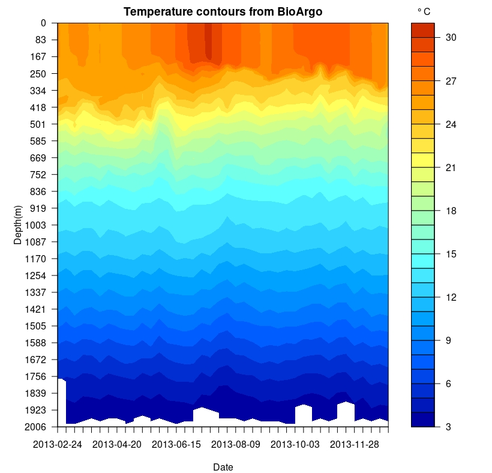
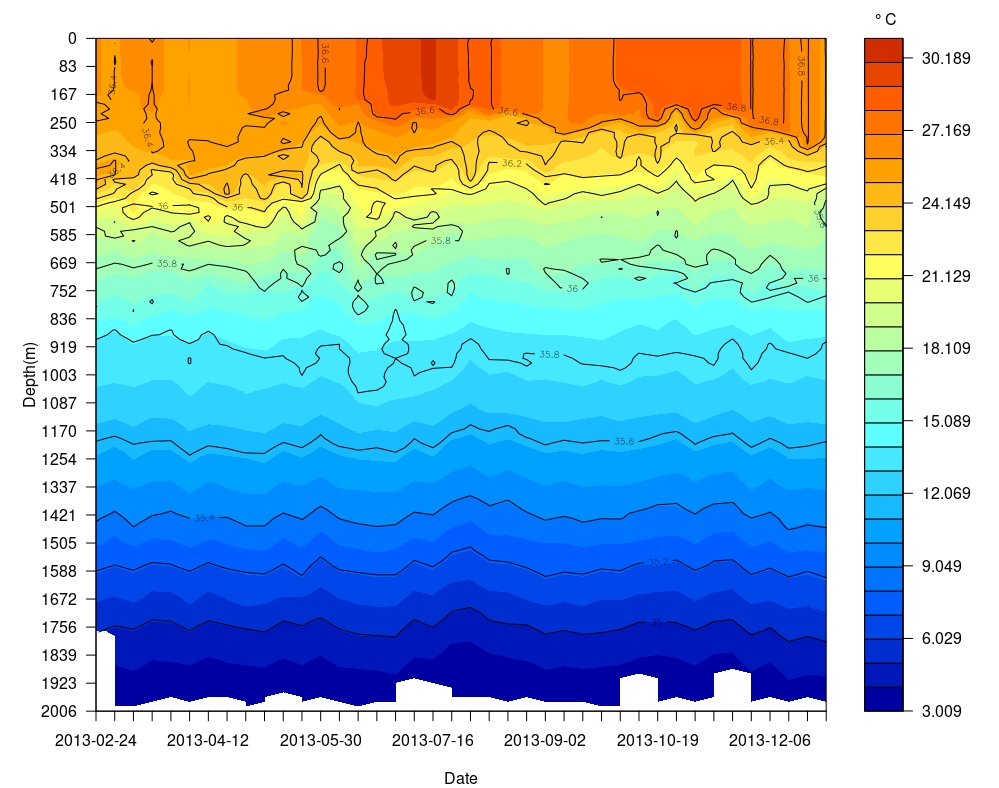

# Ponman : A package for BioArgo data Analysis

Ponman is an R Language implementation developed to reduce the data-researcher barrier to promote the effective use of Bio-Argo floats. More than an R package it have comprehensive tool sets for the Bio-Argo, from data acquisition to plotting. Ponman is a user-friendly package for a regular R user with the aid of our detailed documentation. Oceanographers usually cluttered with enormous amount of data, for analysis and for downloading is a tedious job. Ponman for Bio-Argo could download the data direct to working directory according to your prior categories. Ponman prefers netcdf(.nc) files, which is a set of software libraries and self-describing, machine-independent data formats that support the creation, access, and sharing of array-oriented scientific data. Extraction of the data from .nc files to readable form is the first thing one could do by Ponman. 
## How to install ponman

As ponman was not officially launced in CRAN, it need to download from github. please follow the instructions

```
install.packages(devtools)
library(devtools)
install_github("mishahublog/BioArgo/ponman",ref = "ponman")
```
## Get data to ponman

Getting data to ponman can attain in two ways. Since API programming is not available, the database can be access by FTP(File transfer protocol) or you can manually download to the working directory. 

```
#extract data from a location and time
extractlocation_time<- get_data2ponman(mode = "geotime",location = "indian_ocean",year = "2010",month = "02")

```

You will get an output with a choice to download multiple to single files

```
get_data2ponman(mode = "geotime",location = "indian_ocean",year = "2010",month = "02")

 [1] "20100201_prof.nc" "20100202_prof.nc" "20100203_prof.nc" "20100204_prof.nc" "20100205_prof.nc" "20100206_prof.nc"
 [7] "20100207_prof.nc" "20100208_prof.nc" "20100209_prof.nc" "20100210_prof.nc" "20100211_prof.nc" "20100212_prof.nc"
[13] "20100213_prof.nc" "20100214_prof.nc" "20100215_prof.nc" "20100216_prof.nc" "20100217_prof.nc" "20100218_prof.nc"
[19] "20100219_prof.nc" "20100220_prof.nc" "20100221_prof.nc" "20100222_prof.nc" "20100223_prof.nc" "20100224_prof.nc"
[25] "20100225_prof.nc" "20100226_prof.nc" "20100227_prof.nc" "20100228_prof.nc"
Do you want download all these files? 

1: Yes
2: No

Selection: 

```

You can take single files by just typing name without ""


```
Selection: 2
Type the file name you want to download: 20100226_prof.nc

```

## Reading single files

After downloading the data-sets in working directory. It could be simply read by the function "ExtractBioArgo"

```
Readprofile_1 <- ExtractBioArgo(bioarg = "2902092_001_20180531065847123.nc")


Horray!!, All paramters available
          Date latitude longitude cycle.no pressure temperature salinity    oxygen chlorophyll backscatter
1   2013-02-24 19.08436  66.54972        1      0.6      26.051   36.294 182.54312    -0.02920     0.00028
2   2013-02-24 19.08436  66.54972        1      1.6      26.050   36.298 182.45311     0.31755     0.00040
3   2013-02-24 19.08436  66.54972        1      2.8      26.049   36.299 182.45979     0.29930     0.00108
4   2013-02-24 19.08436  66.54972        1      3.6      26.054   36.295 182.31361     0.29200     0.00107
5   2013-02-24 19.08436  66.54972        1      4.4      26.054   36.296 182.23773     0.32850     0.00116
6   2013-02-24 19.08436  66.54972        1      5.2      26.053   36.297 182.25000     0.32850     0.00104
7   2013-02-24 19.08436  66.54972        1      6.5      26.052   36.298 182.19359     0.31755     0.00108
8   2013-02-24 19.08436  66.54972        1      7.8      26.053   36.298 182.06905     0.30660     0.00104
9   2013-02-24 19.08436  66.54972        1      8.6      26.053   36.298 182.03868     0.32850     0.00116
10  2013-02-24 19.08436  66.54972        1      9.6      26.052   36.299 182.01314     0.31390     0.00097
11  2013-02-24 19.08436  66.54972        1     12.7      26.053   36.298 181.91534     0.35916     0.00128
12  2013-02-24 19.08436  66.54972        1     17.5      26.054   36.299 182.02058     0.42121     0.00109
[ reached getOption("max.print") -- omitted some rows ]

```
## Batch processing of multiple files

Reading multiple files are very convenient for section graphs and comprehensive analysis. To attain this we need to make list of profiles. Here we are going to make a list of profiles from 2013 of platform 2902092.

####Before execuiting the codes be sure about the working directory, check your datasets there.

```
list.files()


[1] "2902092_001_20180531065847123.nc" "2902092_002_20180531065955638.nc" "2902092_003_20180531070031783.nc"
 [4] "2902092_004_20180531070106448.nc" "2902092_005_20180531070157113.nc" "2902092_006_20180531070239736.nc"
 [7] "2902092_007_20180531070456557.nc" "2902092_008_20180531070528935.nc" "2902092_009_20180531070606146.nc"
[10] "2902092_010_20180531070643511.nc" "2902092_011_20180604072048784.nc" "2902092_012_20180604072134870.nc"
[13] "2902092_013_20180604072205241.nc" "2902092_014_20180604072235039.nc" "2902092_015_20180604072258139.nc"
[16] "2902092_016_20180604072347083.nc" "2902092_018_20180604072511656.nc" "2902092_019_20180604072543416.nc"
[19] "2902092_020_20180604072837202.nc" "2902092_021_20180604081553398.nc" "2902092_022_20180604081620427.nc"
[22] "2902092_023_20180605150436103.nc" "2902092_024_20180605150531084.nc" "2902092_025_20180605150603553.nc"
[25] "2902092_026_20180607052540419.nc" "2902092_027_20180607052622437.nc" "2902092_028_20180607052724234.nc"
[28] "2902092_029_20180607052801723.nc" "2902092_030_20180607052832895.nc" "2902092_031_20180607052859008.nc"
[31] "2902092_032_20180607052923673.nc" "2902092_033_20180607052942654.nc" "2902092_034_20180607053022688.nc"
[34] "2902092_035_20180607053230011.nc" "2902092_036_20180607053713007.nc" "2902092_037_20180629043808803.nc"
[37] "2902092_038_20180629043907204.nc" "2902092_039_20180629043957566.nc" "2902092_040_20180629044036565.nc"
[40] "2902092_041_20180629044119761.nc"

```
save your list by giving a name and execute "batch" function

```
profile_list2013<- list.files()

batch(profile_list2013)

```
of course you need to give a name to batch function too

```
> profiles2013<- batch(profile_list2013)
Horray!!, All paramters available
Horray!!, All paramters available
Horray!!, All paramters available
Horray!!, All paramters available
Horray!!, All paramters available
Horray!!, All paramters available
Horray!!, All paramters available
Horray!!, All paramters available
Horray!!, All paramters available
Horray!!, All paramters available
Horray!!, All paramters available
Horray!!, All paramters available
Horray!!, All paramters available
Horray!!, All paramters available
Horray!!, All paramters available
Horray!!, All paramters available
Horray!!, All paramters available
Horray!!, All paramters available
Horray!!, All paramters available
[  omitted some rows ]

```
There will be a notification if all the parametrs are available for each profiles

"Horray!!, All paramters available"

## plotting BioArgo profiles

Now we have the data in hand in list form. you could browse each profiles(or each cycles) by adding numbers in 
double squre brackets

```
profiles2013[[1]]

```
You could plot single profiles by simply type

```
plot_BioArgo(profiles2013[[1]])

```


This is an overview, actually you can plot single profiles also, explore the options!!
By the way you can plot your disred cycles/profiles.

##Triming and filtering of data for plotting

After plotting your first overview(showned above), you could trim accordingly. Mostly we want to get specific depths or in some selected dates. This could be possible by "Filter_bioArgo()"

Suppose you want to trim all the profiles to 0 to 300 pressure values

```
Filter_bioArgo(batchlist = profiles2013,parameter = "pressure",start = 0,end = 300)

```

Give a name and plot

```
profiles2013_0to100<- Filter_bioArgo(batchlist = profiles2013,parameter = "pressure",start = 0,end = 300)

plot_BioArgo(profiles2013_0to300[[1]])

```


## Contour Graphs for comprehensive ocean studies

Section plots helps to interpolate multiple profiles over a spatial or temporal section. As BioArgo floats are not linear in a spatial scale(due to drifting). The possible way here applied was the plotting of temporal sections.Lets start with temperature. Be sure that you data is in list, if it is not , make it using "batch()" as done above. The function Contour.BioArgo() will done this perfectly.

```
# In a simple way the function provides an overview

Contour.BioArgo(Argolist = profiles2013)

```
 


You could also plot single paramters. check the available paramters by ? Contour.BioArgo

```
Contour.BioArgo(Argolist = profiles2013,parameter = "salinity",overview = FALSE)
```



Try changing its colour and levels using the same arguments of base contouring in R, you could also change every arguments as your wish like the default contour function.

```
#changing colour
Contour.BioArgo(Argolist = profiles2013,parameter = "salinity",overview = FALSE,col="red")
#changing Level
Contour.BioArgo(Argolist = profiles2013,parameter = "salinity",overview = FALSE,col="red",nlevel=50)
```





## Filled contours and contour overlays.

Filled contours are efficient ways to display overlays. Inaddition it also calculate Mixed layer Depth(MLD), there is an option to annotate it on the plots. Simply you could plot a filled contour by the function "Filledsectionplots()"

```
# You could any colour schemes, Here I used colourRamps's matlab.like() method

Filledsectionplots(Argolist = profiles2013,parameter = "temperature",col.val = matlab.like(30))


```



There is a list of possible overlays, which you could found  by ?Filledsectionplots(). Here you could found the filled temperature with overlay of salinity.
```
Filledsectionplots(Argolist = profiles2013,parameter = "temperature",col.val = matlab.like(30),overlay = "salinity")

```



You can also use the trimmed data. here I am going to use the same data of above profile.


